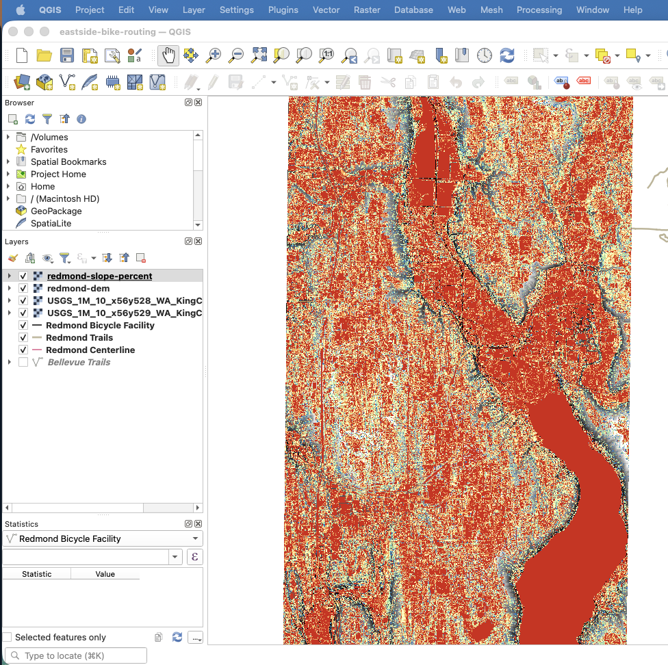
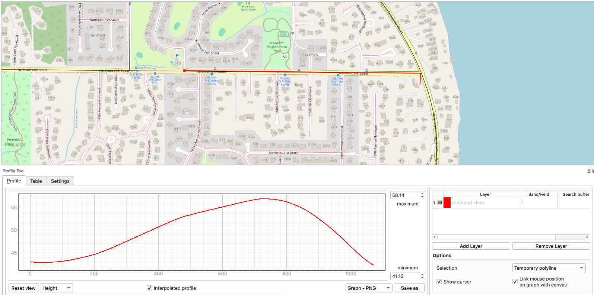

# Eastside Bike Routing 🚲🗺️

A civic GIS + software engineering project exploring how bicycle routing can account for more than distance and travel time.

The project uses municipal open GIS data, bicycle and trail infrastructure, elevation, and spatial analysis to explore routes that may be safer, more comfortable, and more useful for real riders on the Eastside of the Seattle metropolitan area.

## Current Focus

- Building GIS workflows in QGIS
- Working with City of Redmond and Bellevue open GIS data
- Exploring bicycle facilities, trails, and street networks
- Processing USGS elevation data
- Analyzing terrain slope and elevation profiles
- Documenting reproducible GIS workflows with Git and GitHub

## What I'm Exploring

Traditional routing can recommend a technically bikeable route without accounting for what that route actually feels like to ride.

This project explores factors such as:

- Elevation and grade
- Bicycle infrastructure
- Trail and road surface
- Route comfort and accessibility
- Cyclist preferences and experience

## Analysis Highlights

Early spatial analysis on Redmond's bicycle network, built from municipal open data and USGS 1-meter elevation data:

*Slope classification of bicycle network segments — the terrain input behind cyclist-centered route scoring.*

*Elevation profile for a sample corridor, showing what a "bikeable" route actually feels like to ride.*

## Planned Development

### GIS & Spatial Analysis
- Extract grade information for bicycle network segments
- Combine infrastructure, surface, and elevation attributes
- Develop a cyclist-centered route scoring approach

### Web GIS
- Build an interactive prototype map, starting with Leaflet
- Display route characteristics and elevation information
- Compare alternative routes visually
- Level up: rebuild the terrain view with the ArcGIS Maps SDK for JavaScript (SceneView) for 3D slope and elevation visualization

### Spatial Data & Routing
- Introduce PostgreSQL/PostGIS
- Practice spatial SQL
- Build a routable bicycle network
- Compare routes using cyclist-relevant costs

## Project Goal

The long-term goal is an interactive route-comparison prototype that helps cyclists understand **why one route may be a better fit for them than another**.

Rather than simply finding the shortest route, the project explores how spatial data can support routing decisions based on terrain, infrastructure, surface conditions, and rider preferences.
